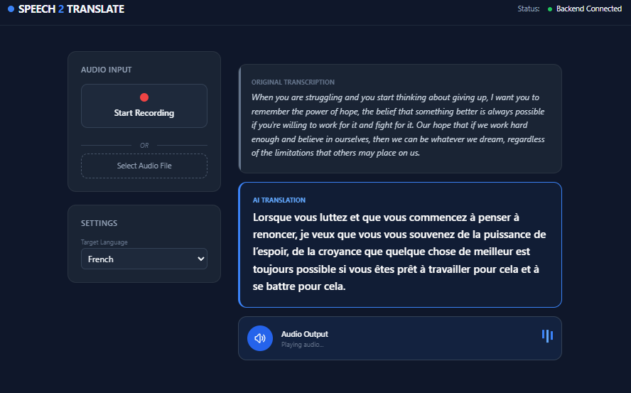

# Speech2Translate | AI Multilingual Showcase

### **Project Vision**
Speech2Translate is a high-performance translation bridge designed for real-time customer service environments. This repository serves as a **Technical Showcase** of a "Cascaded" AI pipeline, demonstrating that high-accuracy, private translation is achievable through localized models.

<p align="center">
  
</p>

---

## Showcase Scope & Experience
This prototype demonstrates a modular, containerized microservices architecture capable of handling the core linguistic challenges of international customer support:

1.  **Acoustic Intelligence:** Leveraging **Faster-Whisper** to achieve near-human transcription accuracy even in low-bandwidth or noisy conditions.
2.  **Linguistic Fluidity:** Implementing **M2M100**, a "Many-to-Many" multilingual model that allows direct translation across 100+ languages without an English-pivot bias.
3.  **Voice-First UX:** A custom frontend utilizing the **Web MediaRecorder API** to capture, process, and display translations with sub-second backend response times.

---

## Project Architecture
The system is orchestrated via Docker to ensure environment parity between development and production.

### **File Structure Description**
* **`.env`**: Centralized configuration for model selection (Whisper-base/large), hardware device selection (CPU/CUDA), and environment-specific endpoints.
* **`docker-compose.yml`**: Manages the multi-container network, linking the Nginx Presentation Layer to the FastAPI AI Engine.
* **`/backend`**:
    * `main.py`: The FastAPI core logic. Orchestrates audio file ingestion, automatic language detection, and neural translation.
    * `requirements.txt`: Optimized dependencies focusing on CTranslate2 for high-speed inference.
    * `Dockerfile`: A specialized Debian-slim build containing **FFmpeg** and pre-cached neural weights to eliminate "cold-start" delays.
* **`/frontend`**:
    * `index.html`: A professional "Glassmorphism" interface built with Tailwind CSS.
    * `script.js`: Handles asynchronous binary audio blobs and dynamic UI state management (loaders/results).

---

## 🚦 Getting Started
1.  **Environment Setup:** Ensure your `.env` is configured for your local hardware (CPU/GPU).
2.  **Deployment:** ```bash
    docker-compose up --build
    ```
3.  **Demonstration:** Access the local dashboard at `http://localhost`.